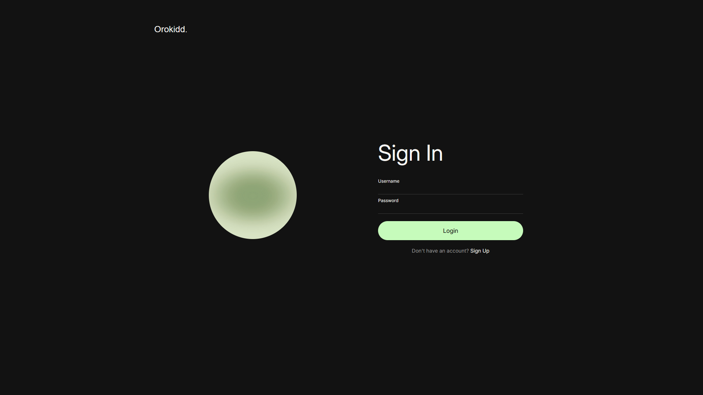
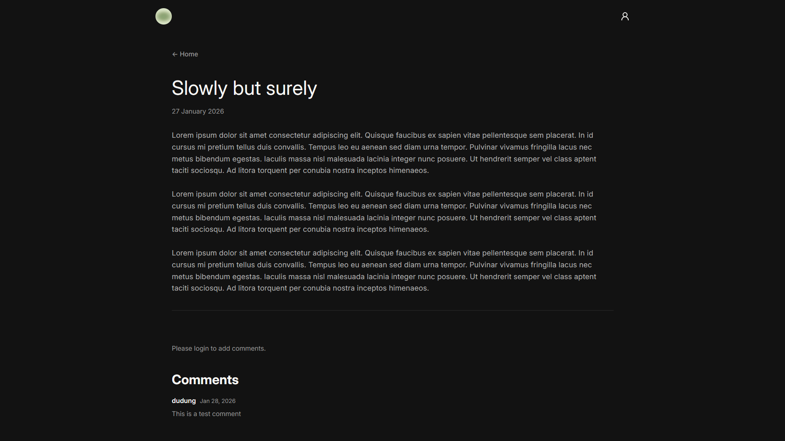

<h1 align="center">
  Blog Post 
  <h4 align="center">Front-end for Blog Post application built with React, Node, Express, PostgreSQL, Prisma ORM, and JWT Authentication</h4>
</h1>

## 🚀 Live Site

The live site can be viewed [here](https://orokidd-blog-client.vercel.app/).

## 📼 Demo

https://github.com/user-attachments/assets/8f12be94-c431-4471-a3bf-b386d6a6337d

## 📝 Project Description

The [project specification](https://www.theodinproject.com/lessons/node-path-nodejs-blog-api) describes the general instructions in doing the project. This project primarily served as practice for understanding React, Node, Express, PostgreSQL, Prisma ORM, and JWT for authentication.
